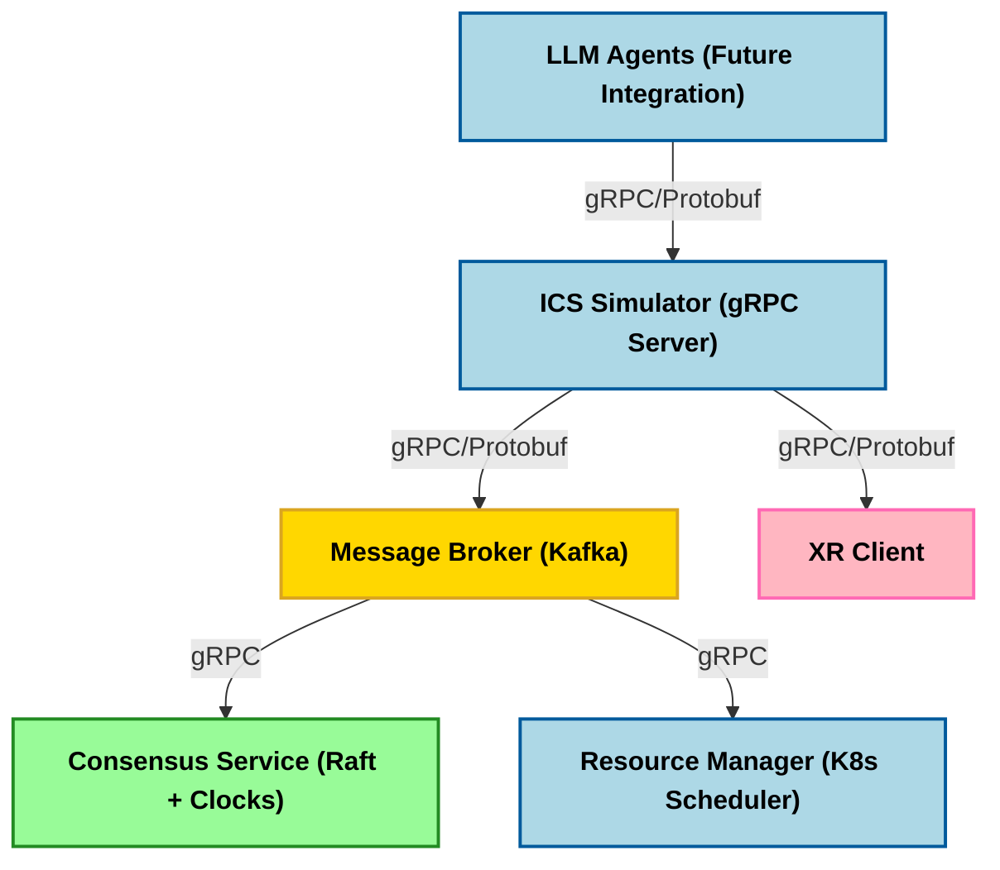

# Conveyor System Simulation with Distributed ICS

A distributed Industrial Control System (ICS) simulation for conveyor systems, incorporating Raft Consensus, Kafka Message Broker, and Kubernetes-based resource management.

## Overview

This project implements a distributed control system for simulating and managing conveyor belt operations. It demonstrates modern distributed systems architecture with real-time control capabilities.

### Key Components

- **Client**: Simulates conveyor belt operations and sensor data generation
- **Server**: Core ICS simulator processing sensor data and system logic
- **Kafka Message Broker**: Handles inter-component communication
- **Raft Consensus Service**: Manages distributed consensus and leader election
- **Resource Manager**: Kubernetes-based workload scheduling
- **XR Client**: Optional AR/VR integration capability
- **LLM Agents**: Future AI-driven optimization (planned feature)

## Architecture



## Prerequisites

- Docker Desktop
- Minikube
- kubectl
- Python 3.8+
- gRPC tools
- Protocol Buffers compiler

## Installation

1. Clone the repository:
```bash
git clone https://github.com/yourusername/conveyor-system-simulation.git
cd conveyor-system-simulation
```

2. Install dependencies:
```bash
# Server dependencies
cd server
pip install -r requirements.txt

# Client dependencies
cd ../client
pip install -r requirements.txt
```

## Development Setup

### Local Development

1. Start Minikube:
```bash
minikube start
```

2. Configure Docker environment:
```bash
# For PowerShell
minikube docker-env | Invoke-Expression

# For Bash
eval $(minikube docker-env)
```

3. Build Docker images:
```bash
# Build server image
docker build -t server:latest -f server/Dockerfile server

# Build client image
docker build -t client:latest -f client/Dockerfile client
```

### Kubernetes Deployment

1. Apply Kubernetes configurations:
```bash
kubectl apply -f kubernetes/
```

2. Verify deployment:
```bash
# Check running pods
kubectl get pods

# Check services
kubectl get svc
```

### Monitoring and Debugging

Monitor system components:
```bash
# View pod logs (replace <pod-name>)
kubectl logs <pod-name>

# Get detailed pod information
kubectl describe pod <pod-name>

# Stream logs from a specific pod
kubectl logs -f <pod-name>
```

## Usage

1. Access the system dashboard:
```bash
minikube service dashboard-service
```

2. Start the simulation:
```bash
# In the client directory
python client.py --host localhost --port 50051
```

3. Monitor metrics:
```bash
# Access Prometheus metrics
minikube service prometheus-service
```

## Troubleshooting

### Common Issues

1. **Pods not starting:**
```bash
# Check pod status
kubectl get pods
kubectl describe pod <pod-name>
```

2. **Service connectivity issues:**
```bash
# Verify service endpoints
kubectl get endpoints

# Test service connectivity
kubectl port-forward service/<service-name> <local-port>:<service-port>
```

3. **Resource cleanup:**
```bash
# Delete all resources
kubectl delete -f kubernetes/

# Delete specific resources
kubectl delete pods --all
kubectl delete deployments --all
kubectl delete services --all
```

## Contributing

1. Fork the repository
2. Create a feature branch (`git checkout -b feature/amazing-feature`)
3. Commit changes (`git commit -m 'Add amazing feature'`)
4. Push to branch (`git push origin feature/amazing-feature`)
5. Open a Pull Request

## Future Enhancements

- Integration of LLM agents for predictive maintenance
- Enhanced XR client capabilities
- Advanced anomaly detection
- Real-time optimization algorithms
- Extended monitoring and alerting

## License

This project is licensed under the MIT License - see the [LICENSE](LICENSE) file for details.

## Contact

Muhammad Hassan Sohail - [@LinkedIn](https://www.linkedin.com/in/mhassan-sohail/)
Project Link: [https://github.com/hsn07pk/conveyor-system-simulation](https://github.com/hsn07pk/conveyor-system-simulation)